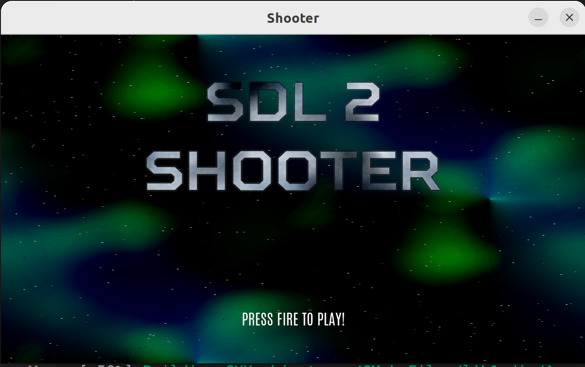
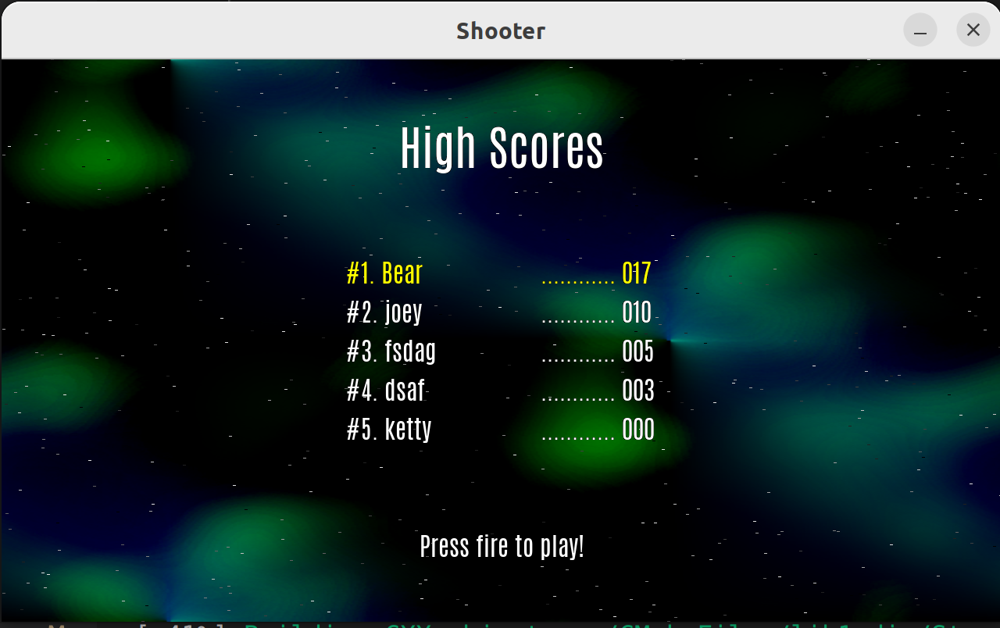

# 2D Shooter Game

## How to Play

Welcome to the 2D Shooter Game! Here are the basic controls to get you started:

- **Fire**: Press the left control key to fire your bullet.
- **Move**: Use the arrow keys (up, down, left, right) to navigate your character through the game world.

## Gameplay

Your objective in the game is to survive as long as possible while defeating enemies and collecting points. You can gain score in the following ways:

- **Defeating Enemies**: Each enemy you successfully eliminate will earn you points.
- **Collecting Points**: Keep an eye out for points scattered throughout the game world. Collecting them will increase your score.

## Getting Started

### Dependencies

Before playing the game, make sure you have the following dependencies installed:

- **SDL**: SDL (Simple DirectMedia Layer) is a cross-platform development library designed to provide low-level access to audio, keyboard, mouse, joystick, and graphics hardware.
- **SDL_image**: SDL_image is an extension library that enables SDL to load popular image file formats such as PNG, JPEG, and GIF.
- **SDL_mixer**: SDL_mixer is a library for playing various types of audio formats. It provides functions to load, play, and manipulate audio files.
- **SDL_ttf**: SDL_ttf is a library that enables SDL to render TrueType fonts. It allows the game to display text using custom fonts.

### Play the game

1. Launch the game application `shooter`.
2. Use the controls mentioned above to navigate your spaceship and engage enemies.
3. Aim carefully and strategically to maximize your score.
4. Enjoy the fast-paced action and challenge yourself to achieve the highest score possible.

## Have Fun!

Get ready for an adrenaline-pumping experience! Test your skills, defeat enemies, and aim for the top of the leaderboard. Good luck, and may your shots be true!

